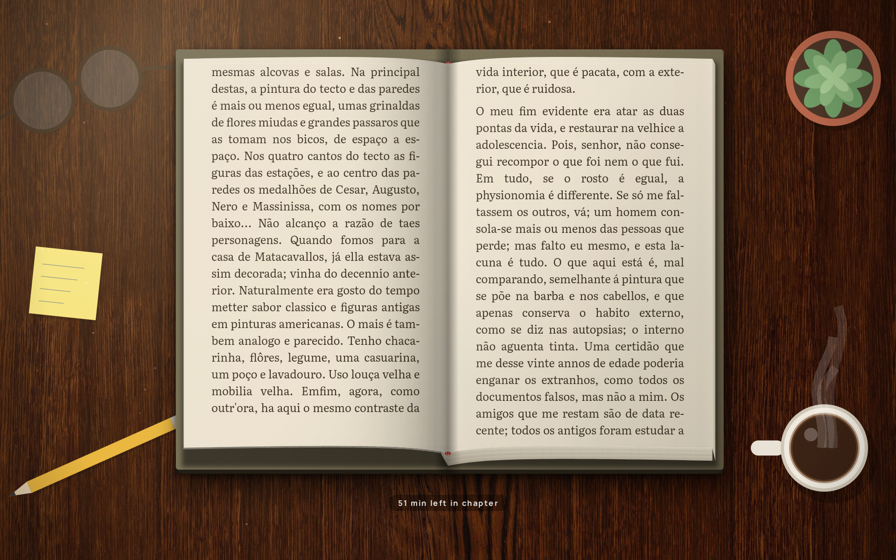
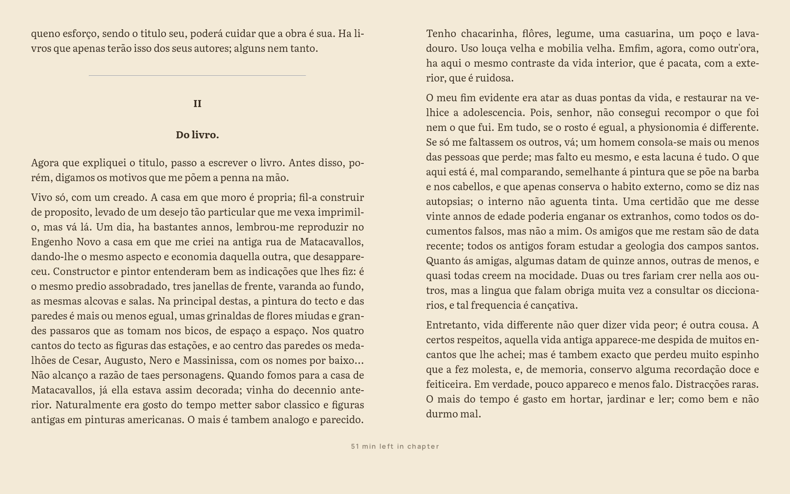
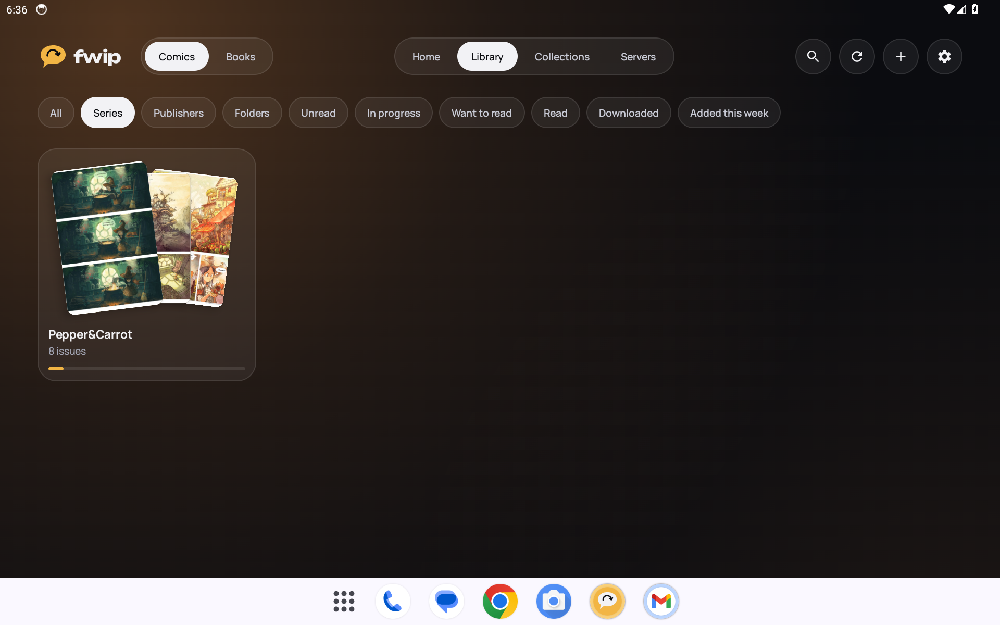

<div align="center">


# Fwip

**Comics and books on Android, read like paper.**<br>
Inspired by Panels on iOS. Made for tablets, at home on phones. Free and open source.

<a href="https://github.com/ChristianDonatti/fwip/releases/latest"></a>

<a href="LICENSE"></a>

[Português](README.pt-BR.md) · [Download](https://github.com/ChristianDonatti/fwip/releases/latest) · [What it does](#everything-it-does) · [Build](#building)

<br>


</div>

<br>

## Why Fwip

<table>
<tr>
<td width="33%" valign="top">

### 📖 Paper that turns
The page curls under your finger, shows its back and casts a soft shadow. In 3D the book lies in a place, by the fire or on a desk, and closes when you finish.

</td>
<td width="33%" valign="top">

### 💬 Panel by panel
Guided reading finds the panels and the speech balloons on the device and takes you through them in order. Double tap a balloon to zoom straight in.

</td>
<td width="33%" valign="top">

### 🗄️ Your files, your NAS
Your own folders, SMB and WebDAV shares, Komga, Kavita and OPDS. Progress follows you between tablet and phone, with no account.

</td>
</tr>
</table>

## A look inside

<table>
<tr>
<td width="50%"><p align="center"><sub><b>A page that turns like paper</b></sub></p></td>
<td width="50%"><p align="center"><sub><b>Balloon by balloon</b></sub></p></td>
</tr>
<tr>
<td width="50%"><p align="center"><sub><b>The 3D book: hardcover, paperback or stapled</b></sub></p></td>
<td width="50%"><p align="center"><sub><b>Comics in 3D, lit by the place</b></sub></p></td>
</tr>
<tr>
<td width="50%"><p align="center"><sub><b>Books: EPUB, Kindle files, FB2 and TXT</b></sub></p></td>
<td width="50%"><p align="center"><sub><b>Series, filters and progress at a glance</b></sub></p></td>
</tr>
</table>

<p align="center">
  
  
  
</p>

<p align="center"><sub>Sample pages: <a href="https://www.peppercarrot.com">Pepper&amp;Carrot</a> by David Revoy, CC BY 4.0. Book: <i>Dom Casmurro</i> by Machado de Assis, public domain.</sub></p>

## Highlights

- **Comics:** CBZ, CBR (RAR4 and RAR5), CB7 and PDF, double pages on tablets, manga mode, webtoon scrolling, margin cropping and filters for old scans
- **Books:** EPUB and Kindle files without DRM, your fonts, highlights with notes, a dictionary, read aloud and time left at your own pace
- **3D:** eight places, drawn or photographed, with moving touches and ambient sound made live; the light of the place falls on the page
- **Library:** a home that follows your reading, series and collections, quick filters, swipe to mark read, generated covers, widgets and stats
- **Comfort:** brightness below the minimum, warm light, e-ink looks, rotation lock, volume keys and tap zones you choose
- **Network:** read from the NAS in place or download, send new comics to the NAS by themselves, sync progress through a shared folder
- **Updates inside the app**, backups in one file, English and Portuguese

## Install

1. Open the [latest release](https://github.com/ChristianDonatti/fwip/releases/latest) on your device and download the APK.
2. Open it and allow installing from this source when Android asks.
3. Open Fwip, tap **Choose folder** and pick where your comics and books live, or connect a server in the **Servers** tab.

New versions show up on the home screen; **Update** downloads and installs them inside the app.

<details>
<summary><b>Test builds</b></summary>

Every push to `main` builds a [test APK](https://github.com/ChristianDonatti/fwip/releases/tag/teste). Test builds use a public development key, so they install over each other but not over an official release (back up in Settings, uninstall, install, restore).

</details>

## Everything it does

<details>
<summary><b>Open the full list</b></summary>

#### Books
- EPUB, Kindle files without DRM (MOBI, AZW3, PRC), FB2 and TXT, laid out by Readium; Kindle files are rebuilt as EPUB with libmobi, TXT and FB2 converted once and kept
- Comics and books share the library, collections and sync; with both, a switch at the top shows one or the other, and books can stand on a shelf by their spines
- Text and page: seven page colours (paper, e-ink, calm, night and more), fonts made for reading (Literata, Bitter, Atkinson Hyperlegible, OpenDyslexic) or your own TTF and OTF files, size, line spacing, margins, justified text, hyphenation, bolder text, publisher styles, one or two columns
- Page turns like paper (the page curls under your finger, as in the comics), or instant, slide or continuous scroll
- 3D book (books and comics): the book lies in a place, its paper curving up from the gutter, the block of pages growing on the left as you read, and the cover opening when you start and closing when you finish; hardcover, paperback or stapled comic (picked by length, or by you), the colour of the place's light on the page, and a size of your choosing
- Places, each drawn and as a photo, with moving touches: a desk, a library, by the fire, mountains, a park, a rainy window over a city, a beach at sunset, a starry night; ambient sound made live by the app (fire, rain, wind, birds, waves, crickets, a clock), and depth when you tilt the tablet
- Time left in the chapter or the book at your own reading pace, like on a Kindle; tap the line to see page or percentage instead
- Contents, bookmarks, search in the whole book, highlights in four colours with notes, shared as Markdown, and a dictionary lookup
- Read aloud with the device's voices, with speed and a sleep timer (minutes or end of chapter)

#### E-reader light
- Brightness below the system minimum, warm light by hand, at sunset or on a schedule, and the room's light sensor
- E-ink themes for the app, and an e-ink look for comic pages (16 greys or soft colour) with an optional refresh blink
- Clock and battery on the page, focus mode (do not disturb while reading) and a screen saver with your covers

#### Reading comics
- Paper page curl that follows your finger, with the back of the sheet and soft shadows; in landscape on tablets the page turns over the spine of a double spread
- Guided reading, panel by panel or balloon by balloon: panels are found from the page gutters (with the ML model as a fallback) and speech balloons by an on-device model, both in reading order with a spotlight; double tap a balloon to zoom straight into it
- Page overview with thumbnails, a page bar made of little pages (like Panels) with a big preview while you drag it, bookmarks, manga mode (right to left), automatic margin cropping, wide double pages shown whole
- Vertical scrolling for webtoons and long strips (picked automatically for very tall pages)
- Your gestures: choose what a double tap, a long press and swiping up or down do (zoom, controls, page overview, bookmark, panel by panel, close)
- Page turn feel: four page sounds, turn speed, how high the page arcs and how deep the fold shading is
- Comfort: brightness just for reading, warm night light, keep the screen on, rotation lock, configurable tap zones, volume keys, a light vibration and an optional paper sound on each turn
- Reader look: black, gray or paper background, spine shadow strength and an optional paper texture on the turning page
- Page filters for old scans: yellowed paper made white again and faded ink darkened, less noise, sharper lines
- Double pages split in two halves when only one page fits on screen

#### Library
- Your own folders (subfolders included): CBZ, CBR (RAR4 and RAR5, solid archives too), CB7 and PDF
- Launcher-style home: cover carousel with an ambient glow that follows the selected comic, a swipeable shelf of series, collections and folders, and a roomier layout for tablets held upright
- The cover you tap grows into the reader, and shrinks back into its place when you close it
- Home follows your reading: finish an issue and the next one in the series waits at the top, marked Up next
- In list view, swipe a row right to mark it read or left to add it to Want to read, with undo
- Books without a cover get a generated one (four designs, with title, author and series)
- A short guide to taps and gestures the first time you open each reader, and an end card that shows how far you are in the series
- Quick filters in the Library (In progress, Downloaded, Added this week), how much of each series you have read on its card, and a rotation lock in both readers
- Clear messages when a file will not open (damaged, missing, offline, no access) with a retry, and a notice when a folder or server could not be read
- Pinch to make covers bigger or smaller; a short welcome on first launch
- Make it yours: six themes (Night, Paper, OLED, Comic, Manga, or follow the system) each with its own matching colours and title font; the highlight colour can also follow the selected cover or your wallpaper
- Backdrops (cover glow, solid, slowly moving colours or your own picture), cover corners, shadows, titles and read marks (badge, ribbon or faded), a flat, tilted or fanned carousel
- Home sections you can turn on, reorder and add to (pin a collection or a series), plus an optional greeting with your name
- A choice of app icons that match the themes and colours
- Series (even with a single issue), folders, your own collections with a reading order for events, a "Want to read" list, read/unread, filters, sorting and search
- ComicRack reading lists (.cbl) imported as collections in their reading order, with a list of the issues you are missing
- A NEW badge on comics that just arrived, and optional notifications when a new issue of a series you are reading shows up (on the NAS too)
- Your own colour, picture and logo for any series, folder, collection or publisher; publishers get their own shelves
- The library as covers or a compact list; progress on covers as a bar, a ring, a percentage or nothing; pick the tab the app opens on and hide the ones you do not use
- A storage screen: what downloads, covers and temporary files take, and finished downloads cleaned up by themselves when they are still on the NAS
- Receive comics over Wi-Fi: open the address shown in a computer's browser and drop the files
- Fix names, series and covers by hand: edit an issue, rename a whole series, or pick a cover from any page or image
- Delete comics or move them between folders, the app's downloads and your NAS, keeping progress and collections
- Reading statistics for comics and books together: time a day, pages, finished titles, streaks, completed series and a goal for the year
- Undo instead of "are you sure?": deleting, marking read and removing collections can be taken back for a few seconds
- A page for each comic and book with its cover, synopsis, credits, progress and the rest of its series
- One search for comics, books, series, collections and settings
- Settings in groups with search, two panes on tablets and reset per group
- ComicInfo.xml metadata: series and issue numbers, credits, publisher, date, synopsis; manga flagged as right to left opens in manga mode
- Reset the progress of a comic, next issue card at the end of a comic and icon shortcuts
- Home screen widgets in the app's colours: continue reading (with a next issue button), up next in every series, an event or collection in its reading order, reading stats with the week, new arrivals, and shortcuts (continue, surprise me, receive over Wi-Fi, sync)

#### Your NAS and your devices
- Network folders over SMB (Windows shares, Samba, most NAS) and WebDAV: comics are read in place, a block at a time, or downloaded for offline reading, one comic or a whole series straight from the library
- Komga, Kavita and OPDS servers: browse and search catalogs, read online page by page (progress synced back to Komga) or download
- Sync between your tablet and phone without an account: progress, bookmarks and collections go through a folder both devices share (one kept in step by Syncthing or similar, or a network folder). Each device writes its own small file in a hidden `.fwip` folder there and reads the others', so sync tools never see conflicting edits. Comics are matched by file name and size
- This device to the NAS: comics put in the tablet's folders are copied to a NAS folder by themselves (on Wi-Fi by default), keeping their subfolders. Nothing is ever deleted on the other side, and a comic in both places shows once and shares its progress, so you can delete it from the tablet and keep reading it from the NAS
- Backup and restore in a single file (servers are saved without passwords)
- A notice on the home screen when a new version is out on GitHub; Update downloads and installs it inside the app (Android asks once to allow Fwip to install its own updates), and a crash report you can save and send
- English and Portuguese (follows the system, or pick the app language on Android 13+)

</details>

## Releases

Tagged versions are built and signed with a private key by the Release workflow; see [RELEASING.md](RELEASING.md). Store texts and images for F-Droid live in `fastlane/metadata/android`.

## Translations

Texts live in `app/src/main/res/values/strings.xml` (English) and `values-pt/strings.xml` (Portuguese). To add a language, copy the English file to `values-<code>/strings.xml`, translate it and add the locale to `res/xml/locales_config.xml`.

## Building

Requires JDK 17 and the Android SDK.

```
./gradlew assembleRelease
```

The APK ends up in `app/build/outputs/apk/release/`.

Test builds are signed with the development key in `keystore/`. It is public on purpose so that anyone's builds can update each other; official releases use a private key.

## Tech

Kotlin, Jetpack Compose, Glance, LiteRT (TensorFlow Lite), Readium, libmobi, Apache Commons Compress, junrar, 7-Zip-JBinding, smbj, OkHttp, Android PdfRenderer, Coil.

## License

Fwip is free software, released under the [GNU General Public License v3.0](LICENSE) or later.
You can use, study, share and modify it, as long as derived versions stay under the same license.

## Credits

Screenshots show [Pepper&Carrot](https://www.peppercarrot.com) by David Revoy (CC BY 4.0), built into sample comics by `scripts/sample_comics.py`; the Screenshots workflow takes them on an emulator when a commit message contains `[screenshots]`. The book is *Dom Casmurro* by Machado de Assis, from [Project Gutenberg](https://www.gutenberg.org/ebooks/55752) (public domain).

Speech balloon detection uses the YOLOv4-tiny model trained by [Seeneva](https://github.com/Seeneva/seeneva-reader-android) (GPL-3.0-or-later, Copyright 2021-2023 Sergei Solodovnikov), see `app/src/main/assets/balloons/NOTICE.txt`.

Archives in RAR5 format are read with [7-Zip-JBinding-4Android](https://github.com/omicronapps/7-Zip-JBinding-4Android) (LGPL 2.1 with the unRAR restriction). SMB shares use [smbj](https://github.com/hierynomus/smbj) (Apache 2.0).

Books are opened and laid out with the [Readium Kotlin Toolkit](https://github.com/readium/kotlin-toolkit) (BSD-3-Clause). Kindle files are read with [libmobi](https://github.com/bfabiszewski/libmobi) by Bartek Fabiszewski (LGPL-3.0-or-later), built from source in `app/src/main/cpp/libmobi`.

Scene photos and the desk texture come from [Poly Haven](https://polyhaven.com) (CC0, see `app/src/main/assets/scenes/CREDITS.txt`). The drawn scenes and all ambient sounds are made in code by Fwip.

Fonts: [Unbounded](https://github.com/googlefonts/unbounded) and [Manrope](https://github.com/sharanda/manrope) for the app, and [Literata](https://github.com/googlefonts/literata), [Bitter](https://github.com/solmatas/BitterPro) and [Atkinson Hyperlegible](https://www.brailleinstitute.org/freefont/) for books, all under the SIL Open Font License 1.1 (see `FONTS-OFL.txt`).
